# MovieMe 电影搜索推荐系统 - 界面截图说明文档

本目录包含了 MovieMe 系统的完整客户端与管理端界面截图。所有图片均已基于对实际系统页面 URL 和元素特性的第一性原理分析，重新命名为符合业务事实的英文名称。

以下是对系统主要功能模块的视觉展示及说明：

---

## 目录
1. [系统首页 (Homepage)](#1-系统首页-homepage)
2. [多维电影榜单 (Movie Leaderboards)](#2-多维电影榜单-movie-leaderboards)
3. [分类排行榜与过滤 (Discovery & Categories)](#3-分类排行榜与过滤-discovery-categories)
4. [电影详情页面 (Movie Details)](#4-电影详情页面-movie-details)
5. [AI 智能助手推荐 (AI Recommendation)](#5-ai-智能助手推荐-ai-recommendation)
6. [个人中心 (User Dashboard)](#6-个人中心-user-dashboard)
7. [管理后台 (Admin Dashboard)](#7-管理后台-admin-dashboard)

---

## 1. 系统首页 (Homepage)

系统首页主要展示当下的精选与热点电影，右上角提供全局搜索、个人中心、管理后台以及登录状态切换等入口。

### 1.1 今日焦点推荐 (用户 XUNRANA 登录状态)
* **文件名**：`homepage_hero_user_xunrana.png`
* **界面说明**：系统首页主视图顶部（URL: `/`）。在用户 XUNRANA 已登录的状态下，今日推荐焦点海报展示为《霸王别姬》。首页背景采用了影片的沉浸式艺术模糊图，并提供“查看详情”交互。
* **效果图**：
  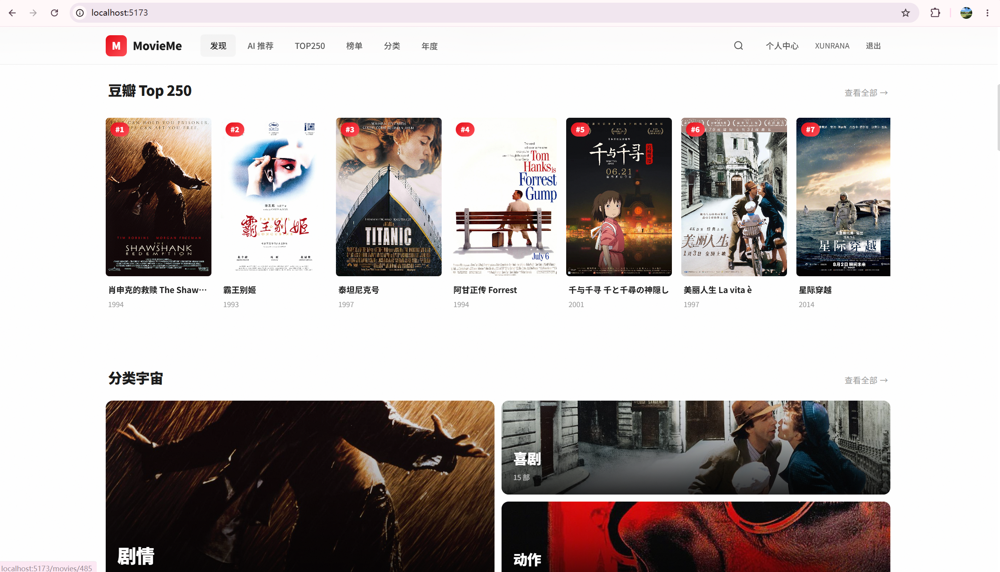

### 1.2 今日焦点推荐 (用户 Zimmeralan 登录状态)
* **文件名**：`homepage_hero_user_zimmeralan.png`
* **界面说明**：系统首页主视图顶部（URL: `/`）。在用户 Zimmeralan 已登录的状态下，今日焦点推荐切换展示为《大话西游之大圣娶亲》。系统会根据今日推荐策略，实现焦点影片的动态轮换与更新。
* **效果图**：
  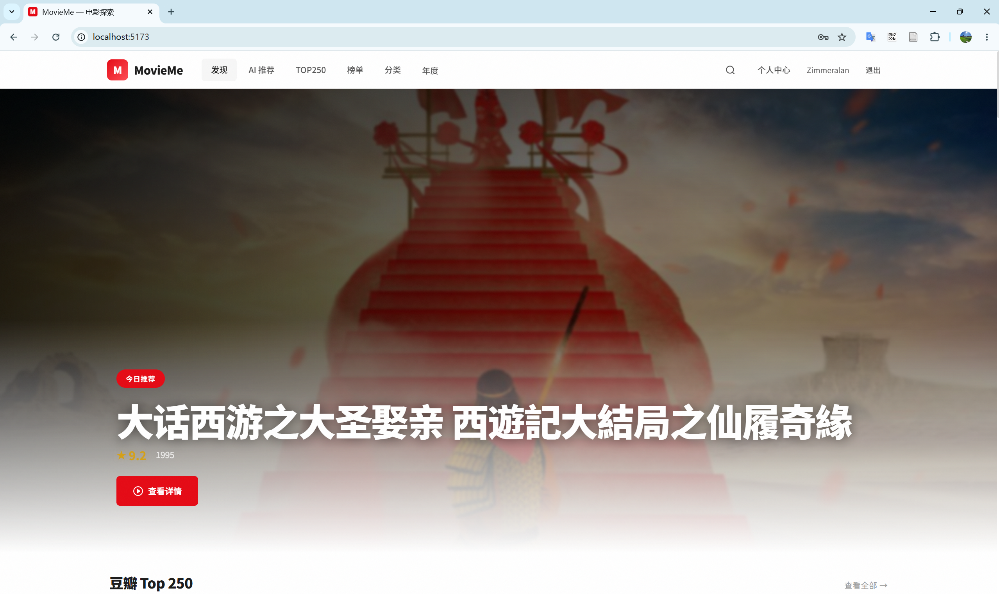

### 1.3 冷门佳作与经典老片模块
* **文件名**：`homepage_sections_gems_classics.png`
* **界面说明**：首页中下部区域。以横向滑动的海报卡片流方式展示评分较高的冷门小众作品（如《陶喆演唱会》等）以及历久弥新的高分经典老片，提供多维度的找片发现入口。
* **效果图**：
  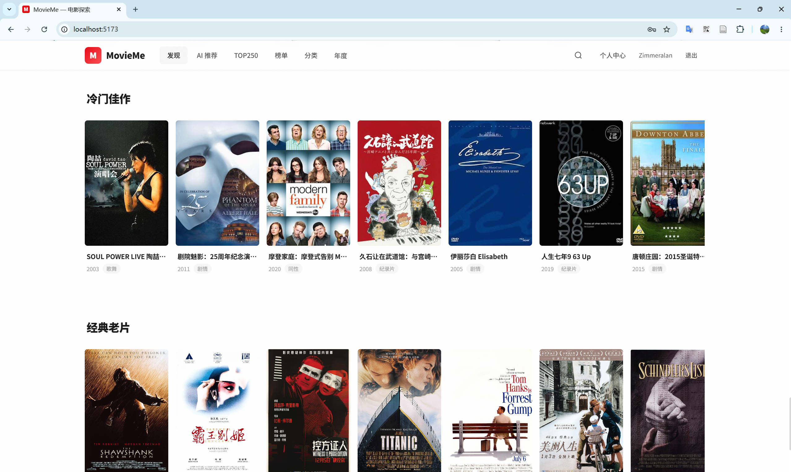

---

## 2. 多维电影榜单 (Movie Leaderboards)

MovieMe 提供了权威且精细化的电影排行榜单，供用户寻找高分佳作。

### 2.1 热门榜单专区
* **文件名**：`movie_hot_boards.png`
* **界面说明**：系统榜单导航页面（URL: `/boards`）。包含“一周口碑”、“北美票房”、“新片榜”三个不同维度的排行推荐，支持卡片式标签页无缝切换。
* **效果图**：
  

### 2.2 豆瓣 Top 250 经典榜单
* **文件名**：`top250_movies_chart.png`
* **界面说明**：豆瓣 Top 250 经典电影页面（URL: `/top250`）。展示豆瓣评分最经典的前 250 部影片排行榜，每部电影均展示高画质海报、金牌评分、基础导演和年份信息，支持翻页浏览。
* **效果图**：
  

### 2.3 2018年度电影榜单主视图
* **文件名**：`annual_board_2018_portal.png`
* **界面说明**：特定年份的年度盘点榜单主页（以2018年为例，URL: `/annual/2018`）。展示该年份最受关注的年度电影焦点（大图为《我不是药神》），以及高分华语电影精选。
* **效果图**：
  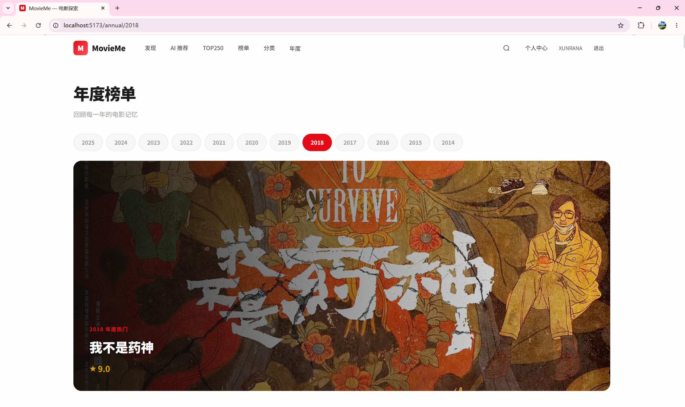

### 2.4 2018年度榜单外语电影
* **文件名**：`annual_board_2018_foreign_movies.png`
* **界面说明**：2018年度榜单页面下拉板块（URL: `/annual/2018` 下拉）。主要展示当年度评分最高的高分外语电影排行（如《头号玩家》、《三块广告牌》等）。
* **效果图**：
  

---

## 3. 分类排行榜与过滤 (Discovery & Categories)

MovieMe 提供了强大的分类检索与条件过滤工具，帮助用户快速筛选海量电影库。

### 3.1 电影分类排行榜入口
* **文件名**：`movie_categories_navigation.png`
* **界面说明**：系统分类排行总览页面（URL: `/charts`）。以精美的超大卡片平铺展示包括传记、儿童、冒险、动作、剧情等数十种类型的分类入口导航，界面井然有序。
* **效果图**：
  

### 3.2 分类下特定类型电影网格
* **文件名**：`movie_category_biography_list.png`
* **界面说明**：特定类型电影的列表页（以“传记”为例，URL: `/charts?genre=传记`）。当鼠标悬停在卡片上时，会优雅地浮现出电影的剧情简介与年代细节信息。
* **效果图**：
  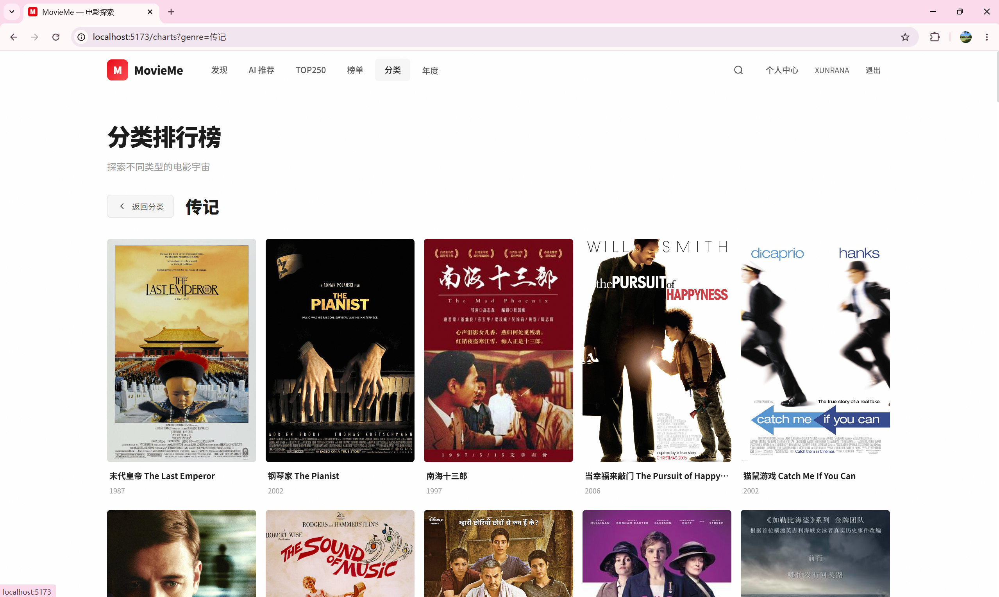

---

## 4. 电影详情页面 (Movie Details)

电影详情页是系统展现电影元数据、用户打分星级分布及相似推荐的核心功能模块。

### 4.1 详情页基本信息
* **文件名**：`movie_detail_farewell_my_concubine.png`
* **界面说明**：详情页主视觉展示（以《霸王别姬》为例，URL: `/movies/486`）。包含大海报、播放平台跳转、打分百分比条形图分布、上映别名、时长以及收藏（想看/看过）交互状态。
* **效果图**：
  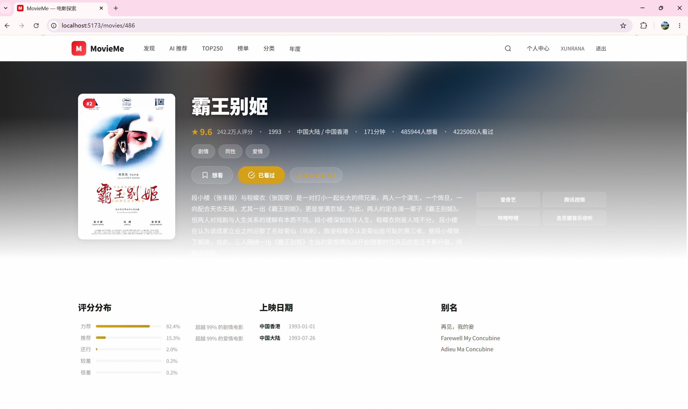

### 4.2 演职人员与获奖记录
* **文件名**：`movie_detail_cast_and_awards.png`
* **界面说明**：详情页中段的演职人员模块与荣誉榜单。使用圆头像整齐展示导演、编剧、主演等职能角色，并罗列影片荣获的世界各大电影节（奥斯卡、金球奖、戛纳电影节等）提名或入围荣誉。
* **效果图**：
  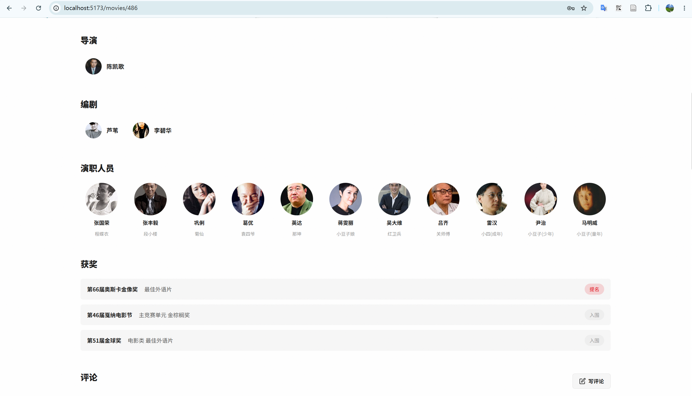

### 4.3 相关推荐电影板块
* **文件名**：`movie_detail_related_movies.png`
* **界面说明**：详情页底部的“相似电影”推荐列表。采用系统算法，智能计算与当前浏览影片最接近的高分作品并进行横向滚动平铺，辅助用户寻找下一部好片。
* **效果图**：
  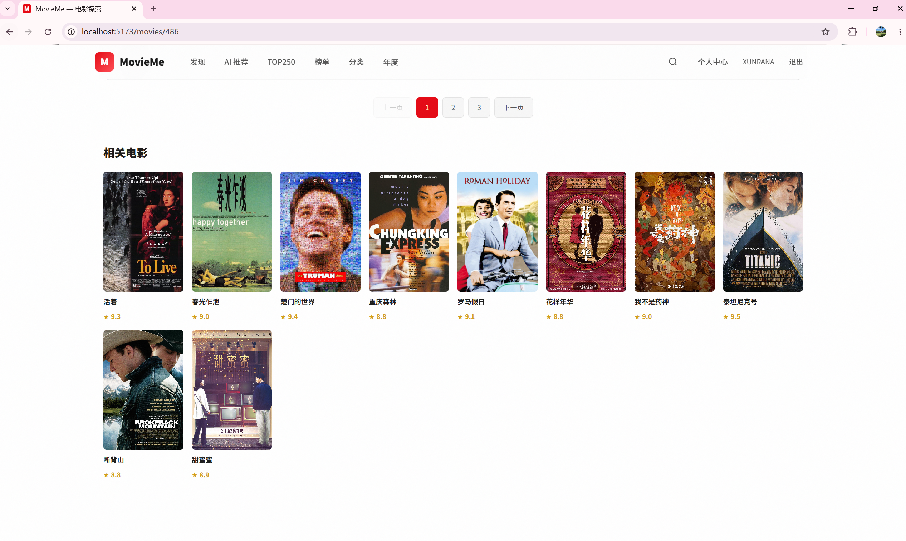

---

## 5. AI 智能助手推荐 (AI Recommendation)

AI 推荐是 MovieMe 的最大亮点，通过接入大语言模型（LLM）向用户提供动态的双向对话式电影推荐和冷启动引导。

### 5.1 AI 推荐助手初始聊天门户
* **文件名**：`ai_recommend_portal.png`
* **界面说明**：AI 智能对话推荐门户（URL: `/recommend`）。左侧展示该用户所有的历史对话列表。右侧主体区域提供欢迎引导卡片，一键生成推荐表单卡片，以及用于向 AI 助手发送指令的底部即时对话框。
* **效果图**：
  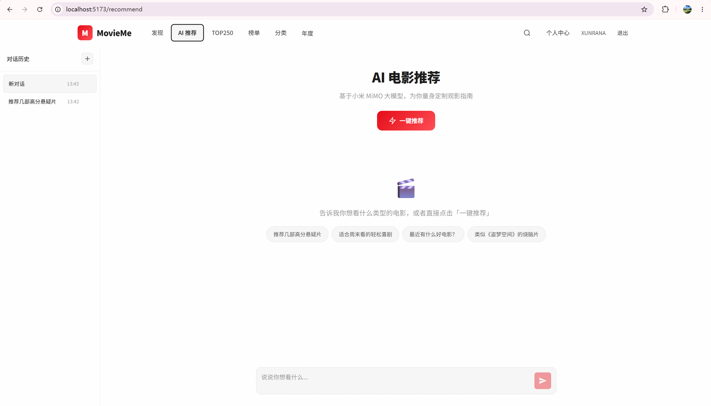

### 5.2 AI 个性化偏好对话推荐
* **文件名**：`ai_recommend_chat_movie_taste.png`
* **界面说明**：对话历史详情页面（URL: `/recommend/...`）。当用户发出“请根据我的口味推荐几部电影”时，AI 智能助手深度读取并剖析了用户的观影档案（如偏好情感浓烈、人性深刻、剧情感人的电影），并在回复中推荐了《辛德勒的名单》并附带亮点剖析和个性化推荐理由。
* **效果图**：
  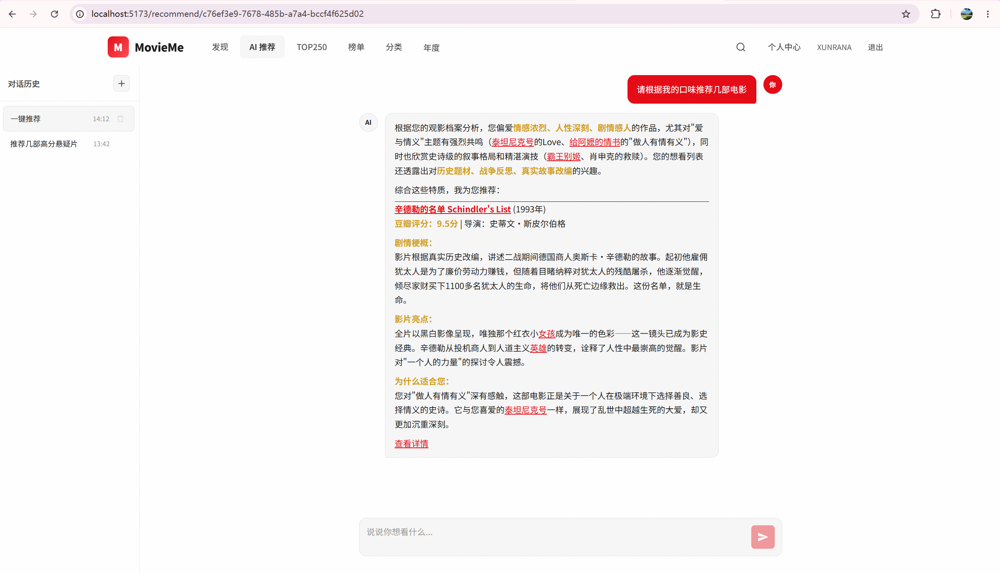

### 5.3 AI 通用模型与数据对话
* **文件名**：`ai_recommend_chat_general_query.png`
* **界面说明**：AI 智能助手问答详情页面（URL: `/recommend/...`）。用户直接向模型提问“你是什么模型”以及要求“中国大陆电影TOP10”。AI 助手结合专业知识库，精准输出了十部中国大陆殿堂级经典电影（《霸王别姬》、《活着》等）的深度推荐清单。
* **效果图**：
  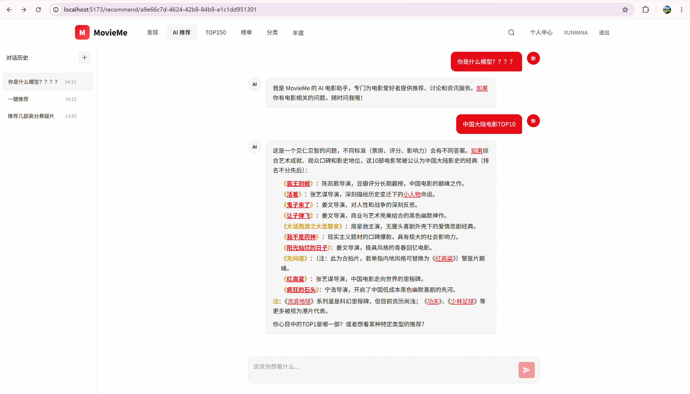

---

## 6. 个人中心 (User Dashboard)

用户个人中心主要对个人行为进行统计并提供历史归档。

### 6.1 个人中心 - 我的评分
* **文件名**：`user_dashboard_ratings.png`
* **界面说明**：个人中心首页（URL: `/user/dashboard`）。顶部以精美的统计卡片展示已评分、想看、看过及浏览历史记录的总数量，下方以网格卡片形式展示用户曾经评分并撰写评价的所有电影历史。
* **效果图**：
  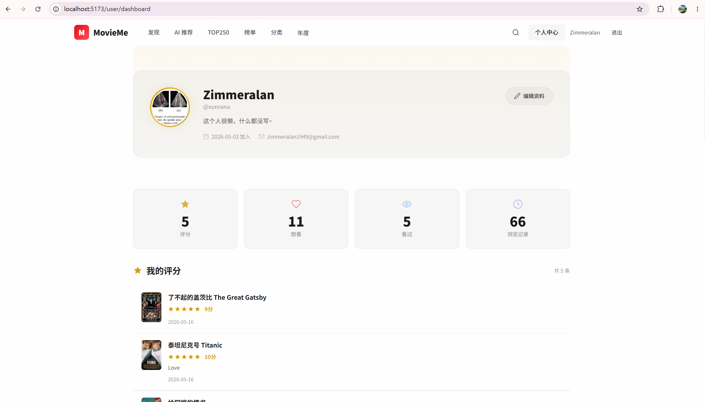

### 6.2 个人中心 - 我的收藏与浏览历史
* **文件名**：`user_dashboard_favorites_and_history.png`
* **界面说明**：用户中心下方区域。支持在“我收藏的想看电影”和“我的浏览历史”两个标签中无缝切换，以横向列表展示已收藏电影，并以美观的时间轴列出用户以往的访问浏览足迹。
* **效果图**：
  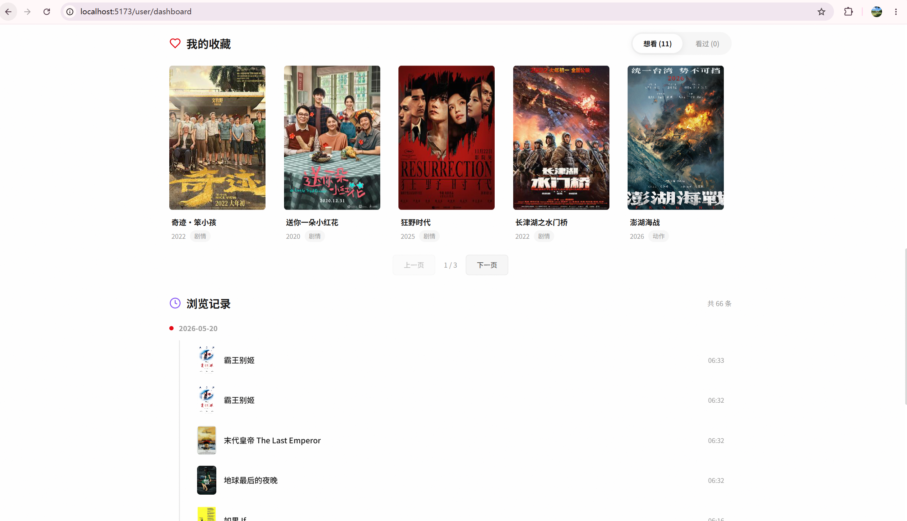

---

## 7. 管理后台 (Admin Dashboard)

面向管理员用户的运维控制台，用于实时监控系统指标及管理系统资源。

### 7.1 管理后台 - 用户管理
* **文件名**：`admin_dashboard_user_management.png`
* **界面说明**：管理员控制台（URL: `/admin/dashboard`）。顶部包含系统运行概览统计卡片（今日新增用户、失败爬虫、电影总数、推荐日志等指标），下方是用户表格管理系统，支持角色变更和状态管理。
* **效果图**：
  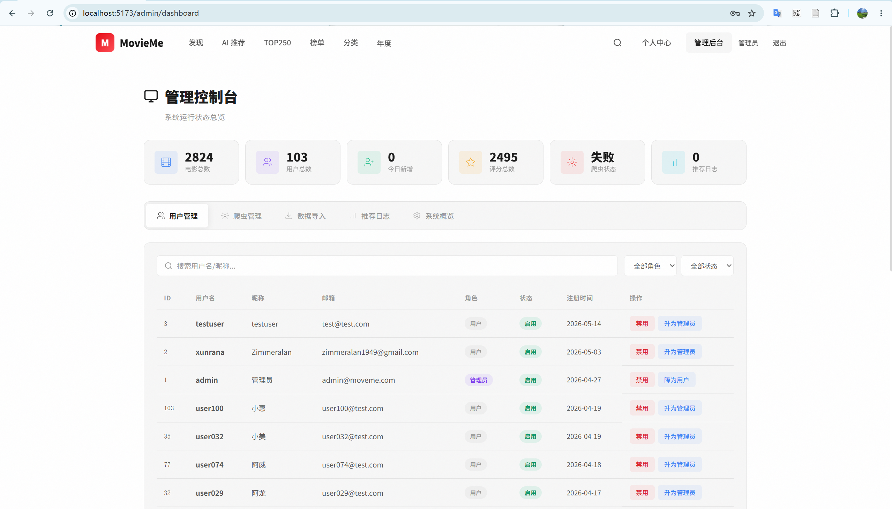

### 7.2 管理后台 - 数据库系统概览
* **文件名**：`admin_dashboard_system_overview.png`
* **界面说明**：管理控制台切换标签后的系统概览页面。通过对 movies, users, ratings, favorites, view_history 等核心数据库表进行数据汇聚和读写检测，将各项系统记录的数量直观地展示给运维管理人员。
* **效果图**：
  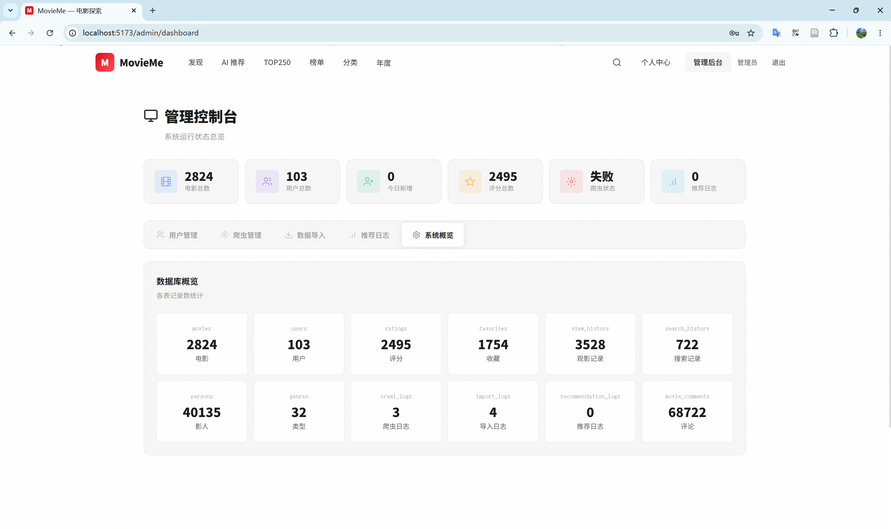
